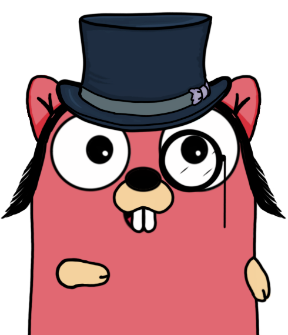

<p align="center">
  
</p>
<h1 align="center" style="color:palevioletred">⇢ groWs ⇠</h1>
<p align="center"><strong>Framework for building Structured and scalable Websocket Servers</strong></p>
<div align="center">


[](https://github.com/kesimo/groWs)
[](https://github.com/kesimo/groWs)
[](https://github.com/kesimo/groWs)
[](https://github.com/kesimo/groWs)
[](https://github.com/kesimo/groWs)
[](https://github.com/kesimo/groWs)
[](https://github.com/kesimo/groWs)
[](https://github.com/kesimo/groWs)


</div>


# Table of Contents

- [Introduction](#introduction)
- [Installation](#installation)
- [Quick Start](#quick-start)
- [Usage](#usage)
    - [Server configuration](#server-configuration)
    - [Creating a Router](#creating-a-router)
    - [Adding Middlewares](#adding-middlewares)
    - [Handlers](#handlers)
- [Documentation](#documentation)
  - [Client](#client)
  - [Events](#events)
  - [Utils](#utils)
- [Examples](#examples)
- [Contributing](#contributing)
- [License](#license)

# Introduction

groWs is a framework for building scalable Websocket Servers. 
It is built on top of the [gobwas/ws](https://github.com/gobwas/ws) library, 
that provides a performant API for working with Websocket connections.

The **Idea** behind groWs is to provide a simple and easy to use API for building Websocket Servers,
that are **Structured**, **Horizontally Scalable** by default, and **Maintainable**. Additionally,
users should not have to worry about the underlying implementation details, and should be able to
focus on the business logic of their application.

Ths is achieved by providing:
- **Handshake**, **Send**, and **Receive** middlewares supported.
- **Multi-Router** support, that allows you to create multiple routers for different purposes.
- **Handlers** for handling events, that are triggered when a connection is opened, closed, or when a message is received.
- **Rooms** support, that allows you to group connections into rooms, and broadcast messages to them.
- **Redis Pub-Sub** support, that allows you to broadcast messages to multiple servers.

# Installation

```bash
go get github.com/kesimo/groWs
```

# Quick Start

This is a minimal example of a groWs server, that listens on port 8080, and handles a single route `/example`.
if a client connects to this route, it will be added to the `testRoom` room
and will be able to receive messages from other clients in the same room.
- If the client sends data like this: `{"event": "testRoom", "data": "..."}`, 
a message gets broadcast to all clients in the `testRoom` room.
- If the client sends the raw message`test`, the server will respond with `test back`.

```go
package main

import (
	"github.com/kesimo/grows"
	"log"
	"net/http"
)

func main() {
	config := groWs.Config{Host: "localhost", Port: 8080}
	app := groWs.NewApp(config)
	
	// Create Handler
	handler := groWs.NewClientHandler()
	handler.OnConnect(func(client *groWs.Client) error {
		groWs.AddClientToRoom(client, "testRoom")
		return nil
	})
	handler.On("test", func(client *groWs.Client, data []byte) error {
		return client.Write([]byte("test back"))
	})
	handler.OnEvent("Broadcast", func(client *groWs.Client, data any) error {
		return groWs.BroadcastEvent("testRoom", groWs.Event{
			Identifier: "broadcast-event",
			Data:       "...",
		})
	})

	// Create a new router
	router := groWs.NewRouter()
	// Add the handler to the router
	router.AddRoute("/example", handler)
	app.AddRouter(router)
	// Add a handshake middleware (for more use app.AddSendMiddleware and app.AddReceiveMiddleware)
	app.AddHandshakeMiddleware("/example", func(r *http.Request, client *groWs.Client) bool {
		log.Println("New connection")
		return true
	})
	// Start the server
	log.Fatalln(app.ListenAndServe())
}
```

# Usage

## Server configuration

To configure the server, you can use the `groWs.Config` struct and pass it to the `groWs.NewApp` function.

```go
config := groWs.Config{Host: "localhost", Port: 4321}
app := groWs.NewApp(config)
```


The `groWs.Config` struct has the following fields:

| Field | Type   | Description                                              | Default |
| --- |--------|--------------------------------------------------------| --- |
| Host | string | The host to listen on.                                | localhost |
| Port | int    | The port to listen on.                                | 8080 |
 | UseTLS | bool   | Whether to use TLS or not.                           | false |
| Cert | string | The path to the certificate file. (if UseTLS is true)    | "" |
| Key | string | The path to the key file. (if UseTLS is true)            | "" |
| EnablePubSub | bool   | Whether to enable Redis Pub-Sub or not.        | false |
| RedisHost | string | The host of the Redis server.                     | localhost |
| RedisPort | int    | The port of the Redis server.                     | 6379 |

## Creating a Router

To create a router, you can use the `groWs.NewRouter` function.

```go
router := groWs.NewRouter()
```

add routes to the router using the `AddRoute` function.
The first argument is the route equal to the pattern used in the `"net/http"` package.
The second argument is the handler that will be called when a client connects to the route.

```go
router.AddRoute("/example", handler)
router.AddRoute("/user/:id", handler2)
```

## Adding Middlewares

You can add middlewares to the router using the `AddHandshakeMiddleware`, `AddSendMiddleware`, and `AddReceiveMiddleware` functions.

**NOTE:** At the moment, multiple middlewares of the same type are not sorted by the order they were added, 
if different patterns matches the same route,
so the order of execution is not guaranteed.

```go
app.AddHandshakeMiddleware("/example", func(r *http.Request, client *groWs.Client) bool {
    log.Println("New connection")
    return true
})
app.AddSendMiddleware("/example", func(client *groWs.Client, data []byte) ([]byte, error) {
    ...
    return data, nil
})
app.AddReceiveMiddleware("/example", func(client *groWs.Client, data []byte) ([]byte, error) {
    ...
    return data, nil
})
```

List of middleware types:

| Type | Description                                  | alias for                                   |
| --- |---------------------------------------------- |---------------------------------------------|
| HandshakeMiddleware | Handle new Client Connection (Auth,RBAC,...) | `func(r *http.Request, client *Client) bool`  |
| SendMiddleware | Handle outgoing messages (Compression,...)   | `func(*Client, []byte) ([]byte, error)`        |
| ReceiveMiddleware | Handle incoming messages (Decompression,...) | `func(*Client, []byte) ([]byte, error)`        |

- The `SendMiddleware` and `ReceiveMiddleware` functions should return the modified message and an error if any.

- The `HandshakeMiddleware` function should return a boolean value indicating whether the connection should be accepted or not.

- Only the first path-matching `HandshakeMiddleware` will be executed. Meaning that if you have multiple middlewares for the same route, 
only the first defined will be executed.


## Handlers

To create a handler, you can use the `groWs.NewClientHandler` function.

```go
handler := groWs.NewClientHandler()
```

### Handle incoming messages

You can add multiple incoming raw messages handlers using the `On` function.
The raw message received from the client will be passed to the handler function.

**NOTE:** The first argument is a *Regex*, so you can use regex to match the message.

usage:
```go
handler.On("test", func(client *groWs.Client, data []byte) error {
	log.Println("test message received")
})
```

### Handle incoming events

You can add multiple incoming events handlers using the `OnEvent` function.
For more information about events, see the [Events](#events) section.

**NOTE:** The `data` argument is an already unmarshalled JSON object, so you can use it directly.

usage:
```go
handler.OnEvent("test", func(client *groWs.Client, data any) error {
    log.Println("test event received")
})
```

### Handle new connections

You can add a handler for new connections using the `OnConnect` function.
- The `OnConnect` function is called once after the handshake is done.
- If the `OnConnect` function returns an error, the connection will be closed.

usage:
```go
handler.OnConnect(func(client *groWs.Client) error {
    log.Println("New connection")
    return nil
})
```

### Handle disconnections

You can add a handler for disconnections using the `OnDisconnect` function.

usage:
```go
handler.OnDisconnect(func(client *groWs.Client) error {
    log.Println("Client disconnected")
    return nil
})
```

# Documentation

## Client

A ``groWs.Client`` represents a client connection and can be used to send messages to the client or store client data.
The Client holds an internal used unique ID, that can be accessed using `client.GetID()`.

### Send a message

To send a message to the client, you can use the `Write`, `WriteJSON`, or `WriteEvent` functions.

```go
// Write a raw message
err := client.Write([]byte("test"))

// Write a JSON message
err := client.WriteJSON(map[string]interface{}{"test": "test"})

// Write an event
err := client.WriteEvent(groWs.Event{
    Identifier: "anyevent",
    Data:       "anydata",
})
```

### Store Metadata

You can store and access metadata in the client using the `SetMeta` and  `GetMeta` functions.
- Set the same key multiple times to update the value.
- The metadata is stored in a map, so the order of the keys is not guaranteed.
- The metadata is stored in the client, so it will be lost if the client disconnects.
- The metadata is available to all middlewares and handlers.

Usage:
```go
// set new metadata
client.SetMeta("key", "value")

// get metadata (returns an `groWs.ErrMetaNotFound` error if the key is not found)
value, err := client.GetMeta("key")
```

### Get current joined rooms

You can get the list of rooms the client is currently joined in using the `GetRooms` function.

```go
rooms := client.GetRooms()
```

### Close the connection

You can close the connection using the `Close` function.

```go
err := client.Close()
```


## Events

An ``groWs.Event`` represents an event sent by the client. It can be used as a wrapper for the data sent by the client.
If you want to send an event to the client, you can use the `client.WriteEvent(event Event)` function.

**RECOMMENDED:** Use events to send data from and to the client, it makes it easier to handle multiple actions on both sides.

The structure of an event is as follows:
```go
type Event struct {
// Event identifier used to identify the event on the client and server side
// The ClientHandler.OnEvent() method uses this identifier to match the event
Identifier string `json:"event"`
// Data is the data that is sent with the event and can be of any type
// On send and receive the data is converted from JSON to any type
Data       any    `json:"data"`
}
```

(**Coming soon:**  Client side library to send and receive events)


## Utils

The `groWs` package contains functions to Send Messages to a Client and to Broadcast Messages to a list of Clients.

**NOTE:** All listed functions are working out of the box with the Redis Pub/Sub implementation, if configured.

### Broadcasting Messages

Function | Description
--- | ---
`groWs.Broadcast(roomId string, message []byte)` | Broadcast a raw message to all clients in a room
`groWs.BroadcastToAll(message []byte)` | Broadcast a raw message to all clients
`groWs.BroadcastEvent(roomId string, event Event)` | Broadcast a event to all clients in a room
`groWs.BroadcastEventToAll(event Event)` | Broadcast a event to all clients
`groWs.BroadcastExcept(id string, message []byte)` | Broadcast a raw message to all clients except the client with the given id (client.GetID())
`groWs.BroadcastEventExcept(id string, event Event)` | Broadcast a event to all clients except the client with the given id (client.GetID())
`groWs.BroadcastByMeta(key string, value interface{}, message []byte)` | Broadcast a raw message to clients with the given metadata key and value
`groWs.BroadcastEventByMeta(key string, value interface{}, event Event)` | Broadcast a event to clients with the given metadata key and value
--- Send to single Client by internal ID --- | ----------------------------------------
`groWs.BroadcastToClient(id string, message []byte)` | Broadcast a raw message to a client with the given id (client.GetID())
`groWs.BroadcastEventToClient(id string, event Event)` | Broadcast a event to a client with the given id (client.GetID())

### Get Informations about Clients

Function | Description
--- | ---
`groWs.GetConnectedClientIds()` | Get a list of all connected client ids
`groWs.GetConnectedClientIdsByMeta(key string, value interface{})` | Get a list of all connected client ids with the given metadata key and value
`groWs.GetConnectedClientIdsByRoom(roomId string)` | Get a list of all connected client ids in the given room
`groWs.GetClient(id string)` | Access a client by its internal id (**NOTE:** This function is not available with the Redis Pub/Sub implementation)


### Handling Rooms

Function | Description
--- | ---
`groWs.AddClientToRoom(client *Client, roomId string)` | Add a client to a room
`groWs.RemoveClientFromRoom(client *Client, roomId string)` | Remove a client from a room
`groWs.RemoveClientFromAllRooms(client *Client)` | Remove a client from all joined rooms
`groWs.GetClientRooms(client *Client)` | Get a list of all rooms the client is currently joined in


### 

# Examples

A full example can be found in the [/examples](github.com/kesimo/groWs/example) directory.

The example gives a suggestion on how to use the library and structure your code.

# Contributing

Contributions are welcome, feel free to open an issue or a pull request.

# License

This project is licensed under the MIT License - see the [LICENSE](LICENSE) file for details


